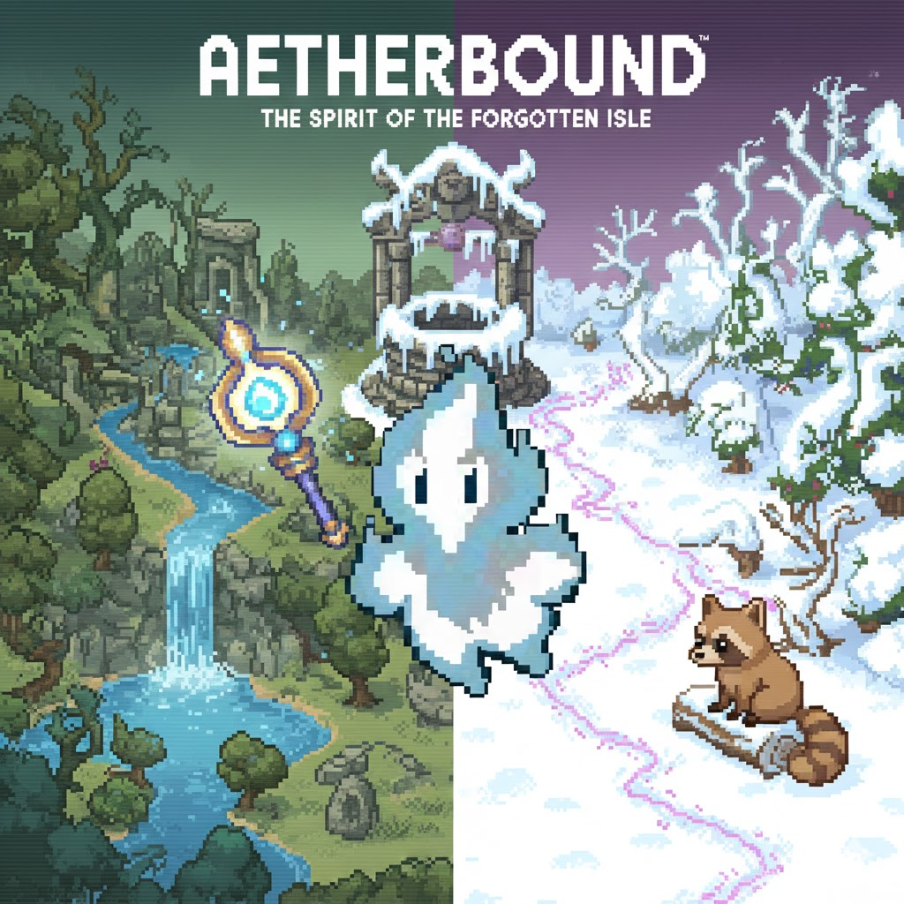

# Aetherbound

A Zelda-inspired action RPG built with Python and Pygame, featuring dynamic combat, character progression, and rich world design.



## Contents

- `code/` — Main source code directory
  - `main.py` — Game initialization and main loop
  - `astar.py` — A* pathfinding implementation
  - `debug.py` — Debugging utilities
  - `enemy.py` — Enemy AI and behavior patterns
  - `entity.py` — Base entity class with physics
  - `input_manager.py` — Handles both keyboard and controller input
  - `level.py` — Level management and sprite groups
  - `magic.py` — Magic spell system
  - `particles.py` — Visual effects system
  - `player.py` — Player controls and mechanics
  - `save_manager.py` — Game save/load functionality
  - `spatial_hash.py` — Spatial partitioning for collision detection
  - `support.py` — Helper functions and utilities
  - `tile.py` — Tile system implementation
  - `ui.py` — User interface components
  - `upgrade.py` — Character progression system
  - `weapon.py` — Weapon system implementation
  - `start_screen.py` — Game start screen and menu
  - `death_screen.py` — Death screen and game over handling
  - `game_complete_screen.py` — Victory screen
  - `save_slot_menu.py` — Save slot selection menu
- `graphics/` — Visual assets including characters, UI, and effects
- `audio/` — Sound effects and music
- `map/` — Level map data
- `saves/` — Save game files (created automatically)

## Controls

### Movement
- W  — Move up
- S  — Move down
- A  — Move left
- D  — Move right

### Combat (Keyboard)
- H  — Use weapon
- J  — Cast magic
- K  — Switch weapon
- L  — Switch magic
- I — Open inventory
- ESC — Pause game / Open menu
- ENTER — Confirm selection
- ARROW KEYS / WASD — Navigate menus

### Controller Support
- A BUTTON — Confirm / Use weapon
- X BUTTON — Cast magic
- Y BUTTON — Switch weapon
- B BUTTON — Switch magic
- START — Pause game / Open menu
- SELECT — Open inventory

## 🛠 Technical Implementation

### Core Technologies
- **Python 3.x**: Core programming language
- **Pygame**: Game development library for rendering, input, and audio
- **CSV Module**: For tile-based map data parsing
- **Math Module**: For trigonometric calculations in visual effects

## Credits & Attribution

### Development
- **Original Tutorial**: [Clear Code's Zelda Tutorial](https://www.youtube.com/watch?v=QU1pPzEGrqw)

### Assets
- **Graphics & Audio**: [Pixel Boy's Ninja Adventure Asset Pack](https://pixel-boy.itch.io/ninja-adventure-asset-pack)

### Inspiration
- **The Legend of Zelda** (Nintendo) — Core gameplay and design
- **Dark Souls** (FromSoftware) — Combat mechanics and progression

## 🚀 Getting Started

### Requirements
- Python 3.8+ (3.10 or 3.11 recommended)
- Pygame 2.x

### Installation

1. Install dependencies:
   ```bash
   pip install -r requirements.txt
   ```

2. Run the game from the project root:
   ```bash
   python code/main.py
   ```

## Troubleshooting

- **Missing Dependencies**: Ensure all requirements are installed with `pip install -r requirements.txt`
- **Asset Loading Issues**: Make sure to run the game from the project root directory (where the `code/` folder is located). The game looks for assets in `graphics/`, `audio/`, and `map/` directories
- **Performance Problems**: Try reducing the game resolution in `settings.py`


*Note: This project was developed based on the Clear Code tutorial with significant custom modifications and expansions.*